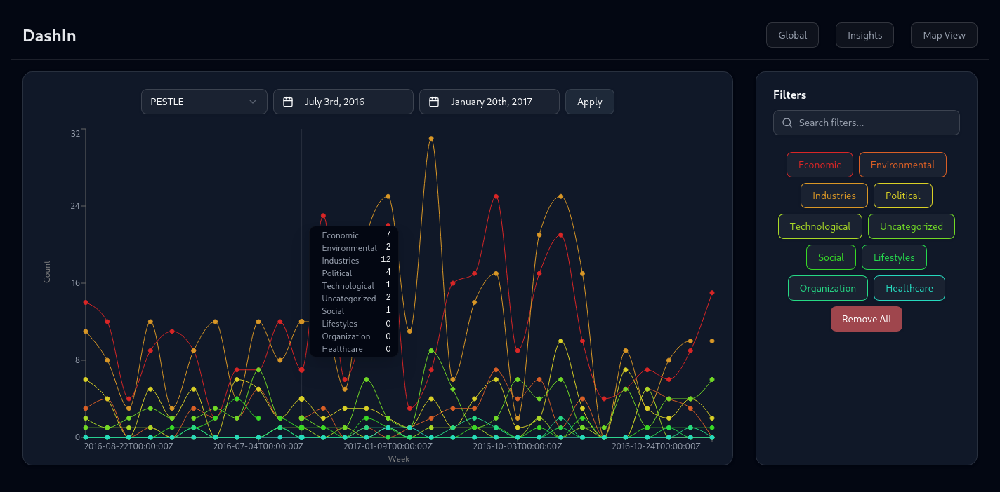

# DashIn



Interactive Dashboard for viewing various published insights regarding environmental studies, socio-political studies, corporate and business policies, etc. Built with Django + React, powered by d3 and ShadCN visuals.

---

## Features

- **Multiple analysis criteria** - Compare by Sectors, PESTLE, Topic, Region and More. Select what you want and only what you want.
- **Overall Breakdown** - View the metrics across different criteria and rankings.
- **Interactive Map** - Use an interactive map to view insights of particular countries and regions.

---

## Tech Stack

- **Frontend** - React, ShadCN, TailwindCSS
- **Backend** - Django, Django REST Framework
- **Charts** - ShadCN, d3

---

## Filestructure

```bash
DashIn
├── backend
│   ├── api
│   │   ├── admin.py
│   │   ├── apps.py
│   │   ├── import.py
│   │   ├── __init__.py
│   │   ├── migrations/
│   │   │   └── __init__.py
│   │   ├── models.py
│   │   ├── serializers.py
│   │   ├── tests.py
│   │   ├── urls.py
│   │   └── views.py
│   ├── backend
│   │   ├── asgi.py
│   │   ├── __init__.py
│   │   ├── settings.py
│   │   ├── urls.py
│   │   └── wsgi.py
│   ├── cleanup_json.py
│   ├── frontend
│   │   ├── app
│   │   │   ├── favicon.ico
│   │   │   ├── globals.css
│   │   │   ├── layout.tsx
│   │   │   └── page.tsx
│   │   ├── eslint.config.mjs
│   │   ├── next.config.ts
│   │   ├── package.json
│   │   ├── postcss.config.mjs
│   │   ├── public
│   │   │   ├── file.svg
│   │   │   ├── globe.svg
│   │   │   ├── next.svg
│   │   │   ├── vercel.svg
│   │   │   └── window.svg
│   │   ├── README.md
│   │   └── tsconfig.json
│   ├── import_csv.py
│   ├── iso.csv
│   ├── jsondata_fixed_old.json
│   ├── jsondata.json
│   ├── manage.py
│   ├── poetry.lock
│   ├── pyproject.toml
│   └── README.md
├── DashIn.png
├── frontend
│   ├── components.json
│   ├── eslint.config.js
│   ├── index.html
│   ├── package.json
│   ├── pnpm-lock.yaml
│   ├── public
│   │   └── vite.svg
│   ├── README.md
│   ├── src
│   │   ├── App.css
│   │   ├── App.tsx
│   │   ├── assets
│   │   │   ├── react.svg
│   │   │   ├── regions.geojson
│   │   │   └── world.geojson
│   │   ├── components
│   │   │   ├── app-sidebar.tsx
│   │   │   ├── charts
│   │   │   │   ├── custom-pi-chart.tsx
│   │   │   │   ├── insights-over-time.tsx
│   │   │   │   ├── map.tsx
│   │   │   │   ├── rankings-region.tsx
│   │   │   │   ├── region-map.tsx
│   │   │   │   ├── region-stacked-pi.tsx
│   │   │   │   ├── stacked-bar.tsx
│   │   │   │   └── time-chart.tsx
│   │   │   ├── command-k.tsx
│   │   │   ├── custom-sidebar-trigger.tsx
│   │   │   ├── date-picker.tsx
│   │   │   ├── Header.tsx
│   │   │   ├── mode-toggle.tsx
│   │   │   ├── theme-provider.tsx
│   │   │   └── ui
│   │   │       ├── button.tsx
│   │   │       ├── calendar.tsx
│   │   │       ├── card.tsx
│   │   │       ├── chart.tsx
│   │   │       ├── checkbox.tsx
│   │   │       ├── collapsible.tsx
│   │   │       ├── command.tsx
│   │   │       ├── dialog.tsx
│   │   │       ├── dropdown-menu.tsx
│   │   │       ├── input.tsx
│   │   │       ├── popover.tsx
│   │   │       ├── select.tsx
│   │   │       ├── separator.tsx
│   │   │       ├── sheet.tsx
│   │   │       ├── sidebar.tsx
│   │   │       ├── skeleton.tsx
│   │   │       ├── switch.tsx
│   │   │       ├── table.tsx
│   │   │       ├── toggle-group.tsx
│   │   │       ├── toggle.tsx
│   │   │       └── tooltip.tsx
│   │   ├── config
│   │   │   └── api.ts
│   │   ├── hooks
│   │   │   └── use-mobile.ts
│   │   ├── index.css
│   │   ├── layout.tsx
│   │   ├── lib
│   │   │   └── utils.ts
│   │   ├── main.tsx
│   │   └── vite-env.d.ts
│   ├── tsconfig.app.json
│   ├── tsconfig.json
│   ├── tsconfig.node.json
│   └── vite.config.ts
└── README.md
```

---

## Setup

```bash
git clone https://github.com/KreativeThinker/DashIn
cd DashIn
```

#### Backend

```
cd backend
python -m venv .venv
source .venv/bin/activate
pip install poetry

poetry install

python manage.py runserver 8001
```

#### Frontend

```bash
cd frontend
pnpm install
pnpm run dev
```

View [http://localhost:5173](http://localhost:5173) for result
